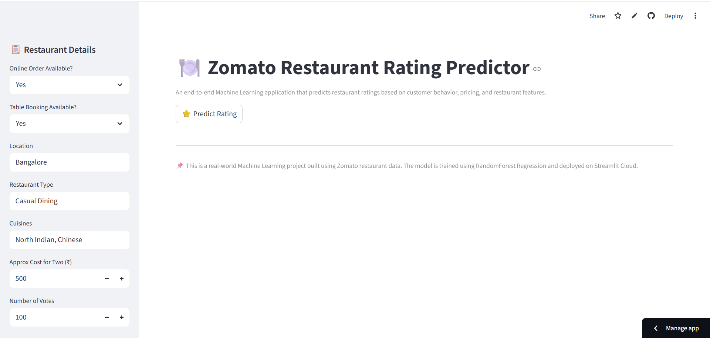
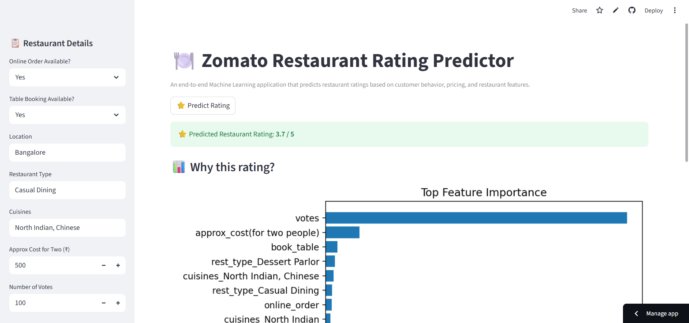
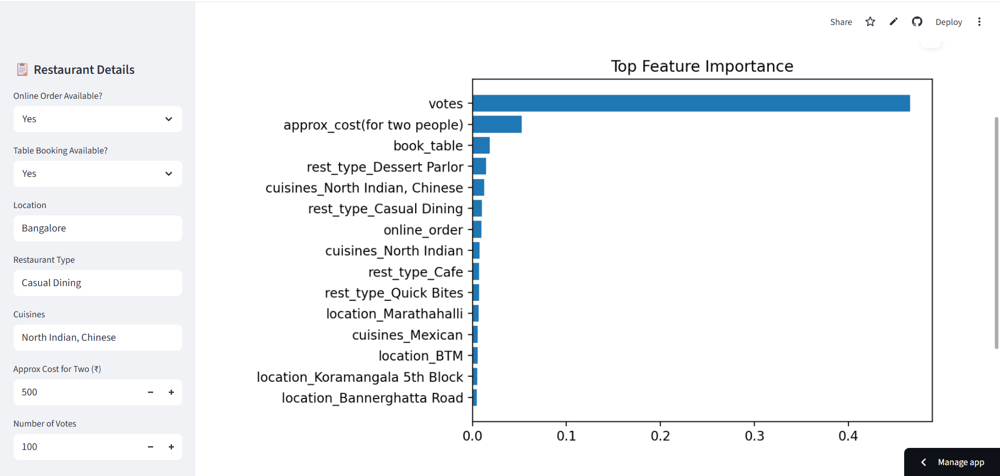

# 🍽️ Zomato Restaurant Rating Predictor

An end-to-end Machine Learning web app that predicts restaurant ratings using customer behavior, pricing, and restaurant features.

Covers the full ML pipeline: data preprocessing, model training, and deployment on Streamlit Cloud.
--- 
## 🚀 Live Demo

👉 **Streamlit App:**  
https://zomato-rating-prediction-kftvk7nl5zorwxrhygsyvn.streamlit.app/

## ⭐ Key Features

- Predict restaurant ratings instantly  
- Interactive Streamlit UI  
- Feature importance visualization  
- Real-time model loading from GitHub  
- Clean and scalable project structure  

## 📸 App Screenshots

### 🏠 App Interface


### ⭐ Prediction Output


### 📊 Feature Importance


---

## 📌 Project Overview

Restaurant ratings influence customer decisions.
Uses historical Zomato data to predict ratings with a supervised ML model.

The model is hosted via GitHub Releases and loaded dynamically at runtime, keeping deployment lightweight and scalable.

---

## 🧠 Machine Learning Approach

- **Problem Type:** Regression  
- **Target Variable:** Restaurant Rating  
- **Model Used:** RandomForest Regressor  
- **Why RandomForest?**
  - Handles non-linear relationships well
  - Robust to outliers
  - Provides feature importance for explainability

---

## 📊 Features Used for Prediction

- Online Order Availability
- Table Booking Availability
- Restaurant Location
- Restaurant Type
- Cuisines
- Approximate Cost for Two (₹)
- Number of Customer Votes

---

## 📈 Model Explainability

Provides feature importance visualization to explain:
- Why a particular rating was predicted
- Which features influenced the prediction the most

This improves transparency and trust in the ML model.

---

## 🛠 Tech Stack

- **Programming Language:** Python  
- **Data Analysis:** Pandas, NumPy  
- **Machine Learning:** Scikit-learn  
- **Visualization:** Matplotlib  
- **Web App Framework:** Streamlit  
- **Model Hosting:** GitHub Releases  
- **Deployment:** Streamlit Cloud  
- **Version Control:** Git & GitHub  

---

## 📂 Project Structure

zomato-rating-prediction/
│── app.py
│── requirements.txt
│── README.md
│── data/
│ └── zomato.csv
│── models/
│ └── model.joblib
│── notebooks/
│ └── data_cleaning.ipynb
│── images/

---

## ⚙️ Model Hosting Strategy

- The trained ML model is **NOT committed to GitHub**
- Instead, it is uploaded as a **GitHub Release asset**
- The Streamlit app downloads the model dynamically at runtime

✔ Prevents large file issues  
✔ Keeps repository clean  
✔ Production-friendly deployment approach  

---

## ▶️ How to Run Locally

1️⃣ Clone the repository
```bash
git clone https://github.com/sobiya57/zomato-rating-prediction.git
cd zomato-rating-prediction

2️⃣ Create and activate virtual environment
python -m venv .venv
.venv\Scripts\activate   # Windows

3️⃣ Install dependencies
pip install -r requirements.txt

4️⃣ Run Streamlit app
streamlit run app/app.py


## 📊 Dataset

- The dataset is based on Zomato restaurant listings.
- It contains information such as restaurant type, location, cuisines, pricing, online ordering, table booking, votes, and ratings.
- The dataset was cleaned and preprocessed before training the machine learning model.
- Used for educational and demonstration purposes only.


## 📌 Project Highlights

- End-to-end Machine Learning project
- Real-world restaurant rating prediction
- Data cleaning and preprocessing using Pandas
- Feature engineering and categorical encoding
- RandomForest regression model
- Feature importance visualization for explainability
- Dynamic model loading using GitHub Releases
- Lightweight and scalable Streamlit deployment
- Clean, industry-standard project structure
- Resume-ready and interview-ready project


## 🧾 Disclaimer

This project is developed for learning and demonstration purposes only.  
It is not affiliated with, sponsored by, or endorsed by Zomato.


## 👩‍💻 Author

**Sobiya Begum**  
Aspiring Data Scientist | Machine Learning Enthusiast  

🔗 GitHub: https://github.com/sobiya57
